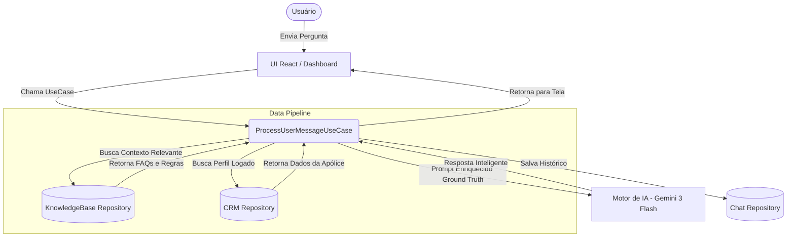

# SeguraBot

O **SeguraBot** é uma plataforma de assistente virtual baseada em Inteligência Artificial, construída com foco em segurança, manutenibilidade e um design premium. A aplicação utiliza uma abordagem de IA híbrida (integrando o Google Gemini e suporte opcional para modelos locais como Ollama) aliada a um banco de dados em tempo real (Firebase) para a gestão do histórico e autenticação.

## Equipe e Informações do Projeto
* **Membros da Equipe:** João Paulo da Silva Cardoso e Leonardo Pereira.
* **Repositório Oficial:** [GitHub - segurabot](https://github.com/jpscard/segurabot)

## Objetivos do Produto
* Prover uma interface de chat inteligente e segura para os usuários finais.
* Garantir um código-fonte altamente sustentável através de uma **Arquitetura Spec-Driven** (Arquitetura Limpa/Hexagonal).
* Oferecer uma experiência de usuário (UX) excepcional, com interface minimalista e profissional, alinhada às melhores práticas de design de software moderno.

## UI/UX
* **Minimalismo Absoluto:** Interface extremamente limpa, sem o uso de ícones ou emojis.
* **Navegação e Controles:** Navegação através de botões estilizados.
* **Estética Visual:** Suporte a temas Claro e Escuro (Light e Dark modes).

## Engenharia de Software e Arquitetura

O projeto adota uma arquitetura inspirada em **Clean Architecture** (Spec-Driven), mas estruturada de forma *flat* (plana) para maior produtividade no ecossistema React/Vite. O objetivo principal é isolar as Regras de Negócio da Infraestrutura e da Tela (UI).

### Estrutura de Diretórios (`src/`)

```text
src/
├── domain/         # Entidades de negócio e Contratos/Interfaces puros (Ports)
├── application/    # Casos de Uso - Orquestração da lógica de negócio pura (ex: ProcessUserMessageUseCase)
├── infrastructure/ # Adaptadores de infraestrutura concretos (ex: FirebaseRepositories, Gemini API clients)
├── presentation/   # Componentes visuais (UI), Páginas e Contextos do React
└── utils/          # Funções utilitárias auxiliares e scripts de carga de banco de dados (seeders)
```

### Princípios de "Harness Engineering" e Testabilidade
O uso intenso de interfaces (`types/`) e a injeção de dependências nos `services/` nos permite isolar completamente as chamadas externas. Podemos testar a lógica do chatbot inteiro injetando *Mock Repositories* do Firebase e do Gemini. Isso garante que a suíte de testes rode em milissegundos em ambientes controlados, sem gastar cota de API ou necessitar de acesso a banco de dados real.

### Pipeline de RAG (Retrieval-Augmented Generation)

Para evitar alucinações da inteligência artificial e entregar respostas precisas sobre apólices e regras de seguros da empresa, implementamos uma pipeline dinâmica robusta:



1. **Ingestão (Upload):** Documentos, NFTs, PDFs e FAQs processados e extraídos via Gemini 3 Flash (usado como LLM para IDP - Intelligent Document Processing) e salvos no Firestore (`knowledge_base`).
2. **Recuperação (Retrieval):** O `IKnowledgeBaseRepository` busca os contextos mais relevantes no Firebase de acordo com a dúvida do usuário.
3. **Aumento (Augmentation):** O Use Case une a pergunta do usuário, os dados da apólice atual (`ICustomerRepository`) e o contexto do RAG diretamente no *System Prompt* do motor inteligente.
4. **Geração (Generation):** A IA gera a resposta com embasamento total nos dados internos do sistema, fornecendo um atendimento altamente personalizado.

### O Desafio: Treinamento e IA

Para tornar o assistente especialista em seguros, o desafio proposto envolve:
* **Treinamento com dados históricos e FAQs:** Melhorar a compreensão e as respostas da IA.
* **Bases de dados para treinamento:**
  * **Datasets de FAQs (Kaggle):** Utilizar conjuntos de dados abertos para adaptação inicial.
  * **Documentação pública:** Processar manuais, termos e condições de apólices.
* **Uso de LLMs (Gemini):** Gerar respostas naturais e compreender intenções complexas.
* **Arquitetura RAG:** Enriquecer o contexto das respostas.
* **(Opcional) Histórico de tickets:** Utilizar dados internos de atendimento anonimizados.
* **(Opcional) Integração CRM:** Acessar informações do segurado para personalizar o atendimento.

#### Status de Atendimento do Desafio no Projeto

O SeguraBot foi construído diretamente para sanar essas necessidades. Atualmente, o status de atendimento é o seguinte:
* **[Concluído] LLMs e RAG:** A arquitetura RAG já está implementada e em funcionamento com o motor Gemini 3 Flash.
* **[Concluído] Bases de Treinamento (Kaggle / FAQs):** Possuímos infraestrutura no Firestore (`knowledge_base`) e scripts de ingestão de dados (`seedKnowledgeBase.ts`).
* **[Concluído] Documentação Pública:** O sistema utiliza a capacidade do Gemini para extrair inteligência de Manuais e Termos de Apólice em PDF e populá-los no banco de dados.
* **[Concluído] Integração CRM (Opcional):** Desenvolvemos o `ICustomerRepository` e um sistema *mock* de CRM (`seedCrmData.ts`), permitindo buscar os dados do usuário logado (nome, apólice, cobertura) para personalização avançada do atendimento.
* **[Pendente] Histórico de tickets (Opcional):** A arquitetura tem a interface pronta para isso, necessitando apenas da carga de dados anonimizados vindos de plataformas de Service Desk reais.

## Funcionalidades
* **Autenticação:** Cadastro, login e logout seguros via Firebase Auth.
* **Gestão de Sessões de Chat:** Histórico e persistência de sessões no Firestore.
* **Motor de IA e RAG:** Integração com APIs do Gemini 3 Flash para análise multimodal e conversação.
* **CRM Integrado:** Integração inicial com dados simulados de CRM de clientes para respostas personalizadas por usuário.

## Como Rodar o Projeto

**Pré-requisitos:** Node.js v18+

1. Instale as dependências:
   ```bash
   npm install
   ```

2. Configure suas variáveis de ambiente. Crie um arquivo `.env` (ou `.env.local`) na raiz do projeto com as chaves necessárias (Firebase, Gemini API Key, etc):
   ```env
   VITE_GEMINI_API_KEY=sua_chave_aqui
   VITE_FIREBASE_API_KEY=sua_chave_aqui
   # Adicione as demais variáveis de configuração do Firebase
   ```

3. (Opcional) Popular banco de dados inicial (Seeders):
   ```bash
   npm run seed:crm
   npm run seed:kb
   ```

4. Inicie a aplicação localmente:
   ```bash
   npm run dev
   ```
