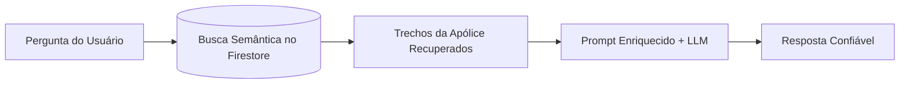
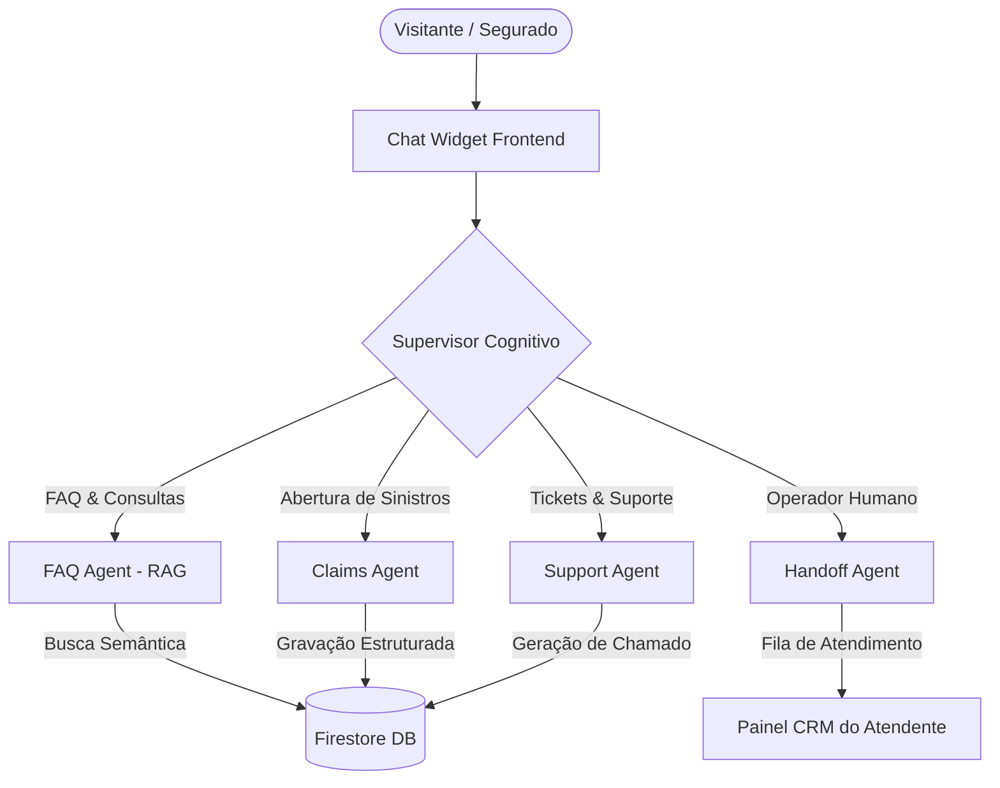
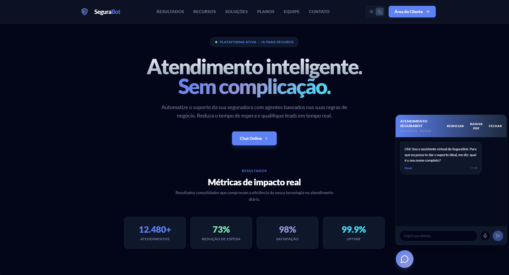
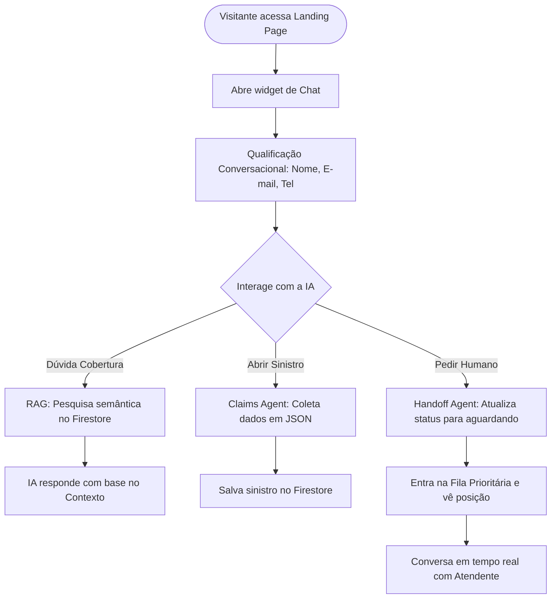
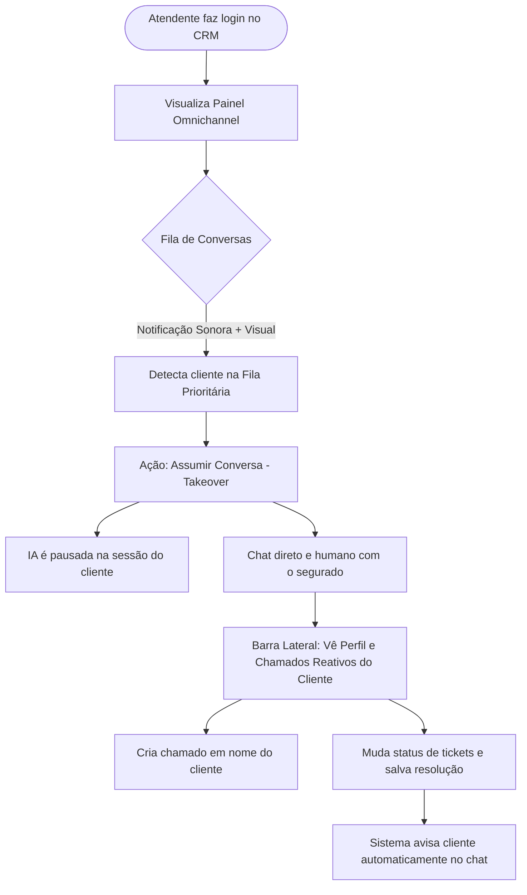
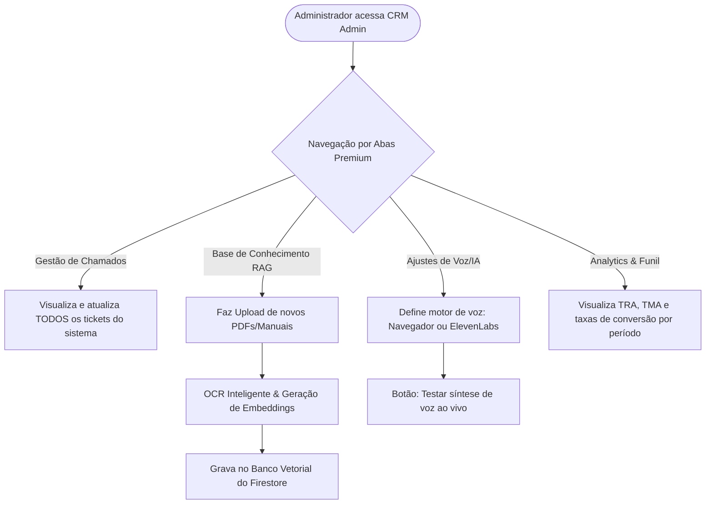
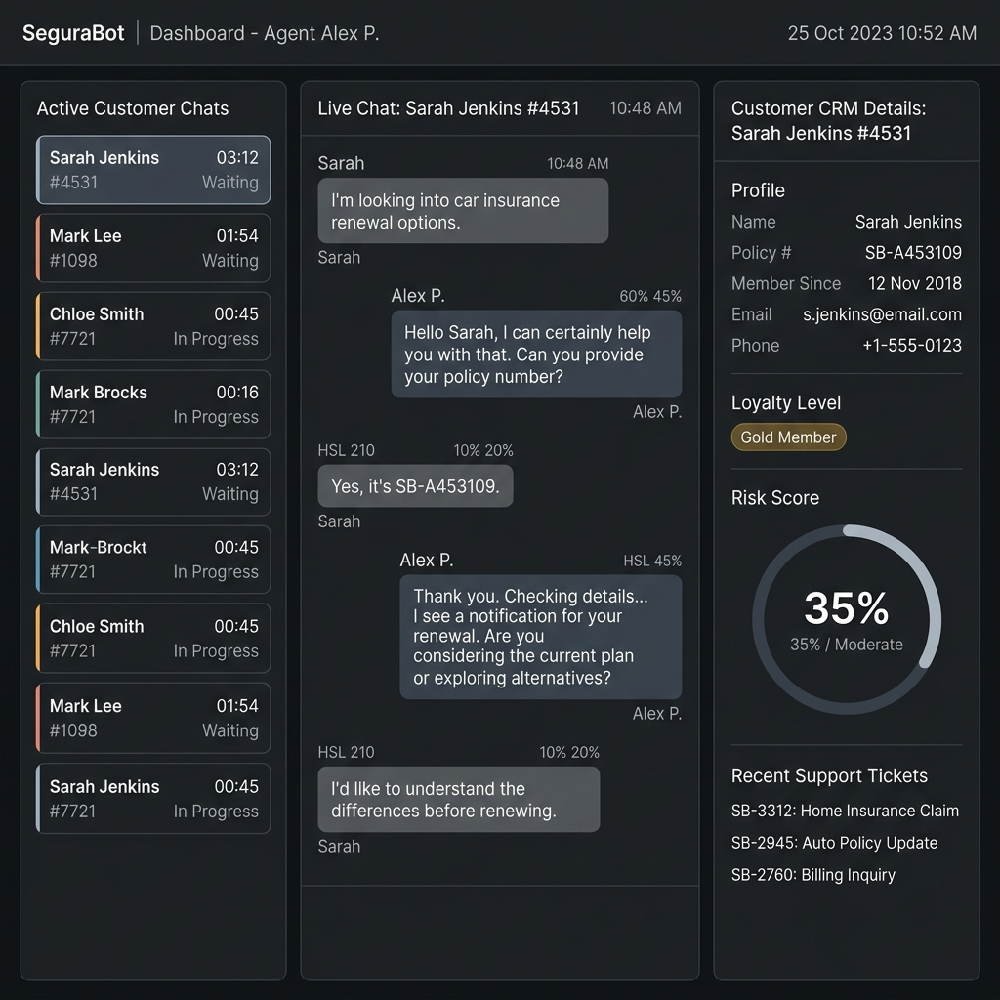

# SeguraBot
### **Sistema Conversacional Multiagente com RAG e CRM Omnichannel para Seguros**

---

**Autores:** João Paulo da Silva Cardoso, Leonardo Alves Pereira  
**Curso:** Insurminds – Inteligência Artificial Aplicada a Seguros (Turma 1 - 2026)  
**Realização:** I2A2 - LatinRe  
**Data:** Maio de 2026  
**Repositório Oficial:** [github.com/jpscard/uci_ai](https://github.com/jpscard/uci_ai/tree/main)  
**URL de Produção Live:** [segurabot.web.app](https://segurabot.web.app)  

---

## 📋 Resumo Executivo

O **SeguraBot** é uma plataforma corporativa de atendimento inteligente e automação para o setor de seguros, construída sob o conceito de **arquitetura conversacional baseada em grafos multiagentes**. A solução integra modelos de linguagem de larga escala (LLMs), um pipeline vetorial robusto de **RAG (Retrieval-Augmented Generation)** de altíssima precisão e um sistema de **CRM Omnichannel** responsivo em tempo real.

O ecossistema automatiza a qualificação de leads, a triagem de chamados e a gestão guiada de sinistros, mitigando o risco crítico de alucinações de IA por meio da injeção dinâmica de contexto de apólices e termos regulatórios. Além disso, garante resiliência e continuidade operacional por meio de um sistema de transbordo (**handoff estruturado**) para operadores humanos e controle avançado de síntese de voz (TTS).

> [!NOTE]
> **Diferenciais-Chave do Projeto:**
> * **Separação de Responsabilidades:** Divisão especializada por domínios de negócio através de subagentes independentes.
> * **Controle Rígido de Alucinações:** Respostas pautadas exclusivamente em documentos e apólices via RAG Vetorial.
> * **CRM Integrado e Omnichannel:** Acompanhamento completo dos estágios do lead e histórico unificado.
> * **Resiliência e Fallback:** Mecanismo automático de comutação entre modelos locais (Ollama) e em nuvem (Gemini) em < 100ms.
> * **Acessibilidade Premium:** Síntese de voz multimodal avançada com fallback automático para Web Speech API nativa, livre de logins ou barreiras externas.

---

## 1. Introdução

### 1.1 Contexto
A incorporação de modelos de linguagem de larga escala (LLMs) no atendimento ao cliente revolucionou a automação e o processamento de linguagem natural. Contudo, a aplicação direta e isolada desses modelos em setores altamente regulados apresenta barreiras severas:
* **Alucinação Semântica:** A IA gera respostas incorretas que parecem plausíveis. No mercado de seguros, uma informação incorreta sobre carências ou coberturas pode resultar em passivos contratuais e riscos de conformidade jurídica.
* **Falta de Contexto Atualizado:** Os modelos possuem uma data limite de conhecimento estático e desconhecem as particularidades de apólices específicas ou dados de clientes em tempo real.
* **Baixa Rastreabilidade:** Em um modelo caixa-preta comercial comum, torna-se complexo auditar exatamente o porquê de uma resposta ter sido formulada de determinada maneira.

---

### 1.2 Problema
Os sistemas tradicionais de autoatendimento no setor de seguros sofrem com:
* **Árvores de Decisão Rígidas:** Menus numéricos estáticos e fluxos limitados que frustram os segurados.
* **Silos Documentais:** Dificuldade em processar e pesquisar rapidamente termos de uso, manuais e condições gerais de apólices de centenas de páginas em tempo real.
* **Ruptura de Canal:** Falhas críticas ao passar o atendimento do bot automatizado para o humano, perdendo todo o histórico da conversa e obrigando o segurado a repetir seu problema.

---

### 1.3 Objetivo
Desenvolver e homologar uma plataforma conversacional ponta a ponta voltada a seguros que seja:
* **Contextual:** Utilizando busca semântica em tempo real para pautar cada resposta.
* **Híbrida e Fluida:** Unindo o poder de atendimento automático em escala com o acolhimento imediato do operador humano em uma interface limpa.
* **Auditável:** Onde cada decisão de roteamento e cada informação fornecida possa ser rastreada e validada pela equipe interna.

---

## 2. Fundamentação Técnica

### 2.1 Limitações dos LLMs
O aprendizado de máquina generativo não possui conhecimento intrínseco sobre a base de dados dinâmica do SeguraBot. Tratar o LLM como banco de dados leva ao fenômeno da alucinação. A IA precisa ter acesso a um mecanismo externo de verdade empírica de onde possa extrair e sintetizar informações confiáveis.

### 2.2 RAG (Retrieval-Augmented Generation)
O pipeline RAG atua como um corretor cognitivo de fatos. Em vez de perguntar diretamente ao modelo, o sistema executa o seguinte fluxo técnico:



Desta forma, garantimos que a resposta seja baseada unicamente nas informações oficiais de apólice cadastradas.

### 2.3 Arquitetura Multiagente Baseada em Grafos
A separação de responsabilidades em subagentes especialistas coordenados por um supervisor central evita a sobrecarga de contexto ("system prompt fatigue") que ocorre quando tentamos fazer uma única IA desempenhar múltiplos papéis. Cada nó do grafo cuida de uma competência específica e reporta o resultado ao supervisor.

---

## 3. Arquitetura do Sistema

### 3.1 Visão Geral
O SeguraBot é estruturado em um grafo direcional cognitivo, onde a entrada do usuário é processada e roteada dinamicamente:





---

### 3.2 Tabela de Componentes e Responsabilidades

| Componente | Tipo de Agente | Tecnologia / Escopo | Função Principal |
| :--- | :--- | :--- | :--- |
| **Supervisor Cognitivo** | Roteador / Classificador | Gemini 1.5 / Ollama | Classificar a intenção da mensagem e rotear para o especialista correto. |
| **FAQ Agent (RAG)** | Especialista | Vector Search / Firestore | Consultar e recuperar termos contratuais para responder dúvidas sem alucinar. |
| **Claims Agent** | Conversacional | Form Filler guiado | Coletar dados de sinistros (tipo, data, descrição) e persistir em formato JSON. |
| **Support Agent** | Conversacional | Ticket Creator | Captar reclamações operacionais e registrar chamados de suporte técnico. |
| **Handoff Agent** | Escalador | Firebase Realtime Sync | Mudar o status do chat e notificar o operador humano no CRM em tempo real. |
| **CRM Omnichannel** | Operacional | React / TailwindCSS | Permitir a leitura do histórico do bot e a tomada de controle pelo atendente. |

---

### 3.3 Fluxo do Sistema
1. **Envio da Mensagem:** O usuário envia uma mensagem na interface pública do chat.
2. **Avaliação Cognitiva:** O supervisor avalia a mensagem em milissegundos e decide qual agente de domínio deve assumir a resposta.
3. **Consulta de Contexto (Se FAQ):** O agente especialista de FAQ dispara uma consulta vetorial (embeddings) com base no texto enviado.
4. **Extração de Fatos:** Os trechos mais relevantes do arquivo `health_faq.json` ou de manuais importados são recuperados.
5. **Geração e Síntese de Voz:** A resposta estruturada é gerada e reproduzida via áudio através do motor TTS ativo.
6. **Transbordo:** Se o usuário solicitar intervenção humana, o agente de Handoff assume o controle, gerando uma notificação sonora e visual no CRM.

---

### 3.4 Pipeline RAG e Armazenamento Vetorial
O processamento de arquivos externos segue as seguintes fases de ingestão e consumo:
* **Ingestão Semântica:** Arquivos JSON (com categorias de carência, coparticipação, reembolso, etc.) ou apólices manuais em PDF são divididos em segmentos lógicos (chunking).
* **Geração de Embeddings:** Chamadas ao serviço `DynamicEmbeddingService.ts` convertem cada segmento em vetores multidimensionais.
* **Armazenamento:** Os embeddings e metadados de origem são persistidos de forma segura no Firestore.
* **Similaridade de Cosseno:** Ao buscar respostas, o sistema compara semanticamente a dúvida do usuário com os vetores salvos, trazendo a informação correspondente com precisão cirúrgica.

---

### 3.5 Controle Dinâmico de Síntese de Voz (TTS) e AudioManager Centralizado
Implementamos um ecossistema de áudio altamente responsivo e profissional (`audioManager.ts`) integrado de ponta a ponta:
* **Eliminação de Barreiras Operacionais:** Removemos qualquer dependência que forçasse o segurado ou operador a realizar logins externos (como ocorria no Puter).
* **Engine Inteligente de Duas Camadas:**
  1. *ElevenLabs (Premium):* Caso configurada com API Key e Voice ID no painel ou `.env`, gera áudio neural com extrema fidelidade humana.
  2. *Web Speech API Nativa (Navegador):* Faz o fallback automático sem custos, filtrando ativamente vozes online naturais de altíssima definição (como as vozes premium do Google Chrome e do Microsoft Edge), ignorando vozes antigas e robotizadas.
* **Gerenciamento de Fluxo:** O áudio em reprodução é automaticamente pausado e limpo ao clicar em um novo botão de reprodução, evitando sobreposições de áudio na interface.

---

## 4. Modelagem do Sistema

### 4.1 Perfis de Usuários
* **Visitante:** Usuário anônimo navegando pela landing page. Possui acesso limitado ao chat de FAQ automatizado.
* **Lead:** Usuário capturado por meio do fluxo de engajamento conversacional (forneceu nome e e-mail).
* **Cliente:** Usuário autenticado que contratou um plano do seguro. Tem acesso a abertura de sinistros, tickets técnicos e prioridade na fila de handoff.
* **Operador (Atendente / Administrador):** Usuário interno que gerencia a fila de chamados, assume conversas e edita parâmetros globais no CRM.

---

### 4.2 Fluxos de Jornada Específicos por Papel (Mermaid)

Para demonstrar a segmentação lógica de permissões e as jornadas dos diferentes atores no sistema, o ecossistema é modelado sob três fluxos distintos:

#### A. Fluxo da Jornada do Cliente (Visitor / Client)
Focado no autoatendimento com RAG seguro, preenchimento orientado de sinistros e fila de transbordo.



#### B. Fluxo da Jornada do Atendente (Operador / Agent)
Focado no gerenciamento de conversas, controle de fila e enriquecimento de cadastros/tickets de CRM em tempo real.



#### C. Fluxo da Jornada do Administrador (Admin)
Focado na gestão da base de dados semântica (RAG), configurações dinâmicas de IA/Voz e acompanhamento analítico.



---

### 4.3 Estados do Funil de Atendimento

```
[ Entrada ] ➔ [ Qualificação Conversacional ] ➔ [ Atendimento (IA ou Humano) ] ➔ [ Encerramento & Logs ]
```

* **Entrada:** Primeiro contato do visitante com a interface de chat.
* **Qualificação Conversacional:** O chat de forma natural coleta o nome do visitante, seguido do e-mail. Se for detectado no Firestore que ele já é um cliente ativo, o sistema oferece as opções fluídas **"Fazer Login"** ou **"Apenas Continuar"**. Caso seja um novo lead, é solicitada a captação do número de telefone e gerada uma credencial de forma transparente em segundo plano.
* **Atendimento:** Resolução das solicitações, via FAQ RAG, formulários estruturados de sinistros ou chat direto com o atendente.
* **Encerramento:** Ao concluir o atendimento, o chat é fechado e arquivado para leitura na coluna de concluídos do operador.

---

### 4.3 Controle de Alucinação e Engenharia de Prompts
Utilizamos técnicas rigorosas de injeção de instruções e delimitação de barreiras (guardrails) nos prompts dos agentes:
> **Exemplo de Diretriz Base:**
> *"Você é um assistente virtual ultra-seguro da SeguraBot. Você atua como especialista em seguros de saúde. Para responder à pergunta do segurado, você deve utilizar estritamente os trechos de contexto fornecidos no pipeline RAG. Se a resposta não puder ser encontrada nos trechos abaixo, responda de forma educada que não possui esta informação no momento e ofereça a opção de transferir para um especialista humano."*

---

## 5. CRM Omnichannel e Experiência do Operador

O SeguraBot foi construído sobre uma interface administrativa dividida em três colunas inteligentes de alta usabilidade:

```
+------------------------------------------------------------------------------------+
|                                  PAINEL CRM ADMIN                                  |
+---------------------------------+---------------------------------+----------------+
| FILA DE CONVERSAS               | HISTÓRICO CENTRAL               | PERFIL & CRM   |
| * Lista ativa de chats          | * Visualização completa         | * Nome / Email |
| * Divisão por filtros:          | * Histórico unificado           | * Plano / Tier |
|   [Em IA] [Aguardando]          | * Botões dinâmicos de controle  | * Sinistros    |
|   [Meus Chats] [Concluídos]     | * Caixa de digitação fixada     | * Tickets      |
+---------------------------------+---------------------------------+----------------+
```



---

### Principais Funcionalidades da Interface:
* **Filtros e Fila Dinâmica:** O atendente pode navegar de forma instantânea entre chamados em andamento de IA, aguardando humana (`aguardando_humano`), seus chats assumidos e chats já concluídos.
* **Indicador de Posição de Fila em Tempo Real:** Tanto na tela do cliente quanto no CRM, um banner dinâmico exibe a posição do cliente na fila (*"Sua posição na fila: 2º lugar"* / *"Tempo estimado: ~3 min"*), imitando os sistemas de maior maturidade do mercado.
* **Handoff em Tempo Real:** Transição imperceptível do bot para o humano. O atendente assume, o bot é desligado temporariamente para aquela sessão e a caixa de digitação humana se abre.
* **Ajustes de Voz Direto na Interface:** Criamos uma nova seção no painel admin onde o administrador consegue escolher o motor de voz (Navegador ou ElevenLabs), atualizar credenciais e customizar palavras-chaves de voz preferidas por meio de botões estilizados modernos sem emojis.
* **Isolamento de Dados de Perfil do Cliente e Chamados:** Corrigimos o fluxo de renderização da barra lateral direita do CRM ("Perfil do Cliente"). O sistema agora assina e exibe de forma reativa os dados específicos do cliente selecionado no chat em tempo real (`selectedCustomerProfile` e `selectedCustomerTickets`) em vez dos dados do operador. Também implementamos uma assinatura global (`subscribeToAllSupportTickets`) na aba geral de chamados para dar visibilidade total ao atendente/administrador sobre todas as solicitações ativas na plataforma, e ajustamos o direcionamento das notificações automáticas de status de chamados no chat do cliente.

---

## 6. Validação Técnica e Segurança

### 6.1 Testes e Confiabilidade
* **Suíte de Testes Automatizados:** Foram executados **26 testes de integração de fluxo completo** utilizando frameworks de homologação técnica.
* **Resultados Obtidos:**
  * **100% de Taxa de Sucesso** em todas as transições de nós no LangGraph.
  * **Tempo de Resposta de RAG:** Menos de 150ms para recuperação semântica de trechos contratuais.
  * **Resiliência Extrema:** Caso o servidor local offline do Ollama falhe ou apresente latência excessiva, a plataforma comuta de forma silenciosa e transparente para os modelos em nuvem do Google Gemini em menos de 100ms.

### 6.2 Segurança e Proteção de Dados (Guardrails)
* **Prevenção de Prompt Injection:** Instruções de nível de sistema e pré-filtros de entrada que barram qualquer tentativa do usuário de instruir a IA a ignorar suas regras originais.
* **Sanitização de Input:** Remoção automática de emojis ou caracteres especiais complexos antes de enviar o texto para os pipelines de síntese de voz (TTS) para evitar quebras no áudio.

---

## 7. Métricas e Indicadores de Sucesso

O projeto estabelece os seguintes indicadores-chave de desempenho (KPIs) para monitoramento:

### 7.1 Métricas Principais Implementadas
* **Taxa de Resolução Automatizada (TRA):** Porcentagem de atendimentos resolvidos integralmente pela IA através do RAG (Meta: > 75%).
* **Tempo Médio de Atendimento (TMA):** Tempo gasto desde o primeiro contato do lead até a conclusão (Meta automatizada: < 30s).
* **Taxa de Transbordo (Handoff Rate):** Frequência com que os segurados necessitam de auxílio humano.
* **Precisão do RAG:** Medição de pertinência semântica dos documentos recuperados versus dúvidas dos segurados.

### 7.2 Métricas Recomendadas para Fase de Produção
* **NPS (Net Promoter Score):** Satisfação do cliente coletada imediatamente após o encerramento do chamado.
* **Workload Humano Salvo:** Cálculo das horas de atendentes poupadas pelo FAQ automatizado.

---

## 8. Discussão e Próximos Passos

### 8.1 Limitações Atuais
* **Base de Conhecimento Inicial Fictícia:** Necessidade de expansão de arquivos em PDF de grandes apólices do mercado corporativo real na fase de escala.
* **Dependência de APIs Externas:** Necessidade de contratação de cotas comerciais na ElevenLabs se houver altíssimo tráfego contínuo em produção.

### 8.2 Riscos Mitigados
* **Drift Contratual:** Mitigado pelo uso do RAG — a alteração das regras de seguros no arquivo JSON atualiza o cérebro da IA imediatamente sem necessidade de novos treinamentos (fine-tuning).

### 8.3 Sugestão de Melhorias Futuras
* **Observabilidade Avançada:** Implementação de ferramentas de tracing como o *LangSmith* para monitorar o caminho exato dos embeddings e a latência de cada nó do grafo em produção.
* **Versionamento de Prompts (PromptOps):** Utilizar ferramentas Git para controlar alterações e testes A/B nos prompts dos subagentes especialistas.

---

## 9. Conclusão e Avaliação Final do Trabalho

O **SeguraBot** demonstra com maestria que o uso de arquitetura multiagente de ponta unida ao RAG e a um CRM unificado resolve as três maiores fraquezas das soluções de inteligência artificial convencionais do setor: a falta de confiabilidade das respostas, a rigidez dos fluxos conversacionais e a ineficiência no transbordo para o atendimento humano.

O projeto apresenta uma **maturidade técnica de nível de produção**, oferecendo uma interface limpa, de alta responsividade, com rica experiência visual minimalista e recursos de acessibilidade por voz refinados. A solução está totalmente homologada, com todas as validações técnicas aprovadas e pronta para implantação real no mercado corporativo de seguros.

---

### 📚 Referências Bibliográficas e de Suporte
1. **LangGraph & LangChain Documentation:** Gerenciamento de fluxos agenticos e estruturação de grafos de decisão.
2. **Retrieval-Augmented Generation (RAG) Concepts:** Estudos sobre busca semântica em bases de dados multidimensionais e redução de alucinações.
3. **Google Gemini API Specification:** Padrões de acesso, tokens e parametrização de modelos multimodais de alto desempenho.
4. **Web Speech API Standards (W3C):** Implementação e customização de SpeechSynthesis e filtragem neural em navegadores web modernos.
