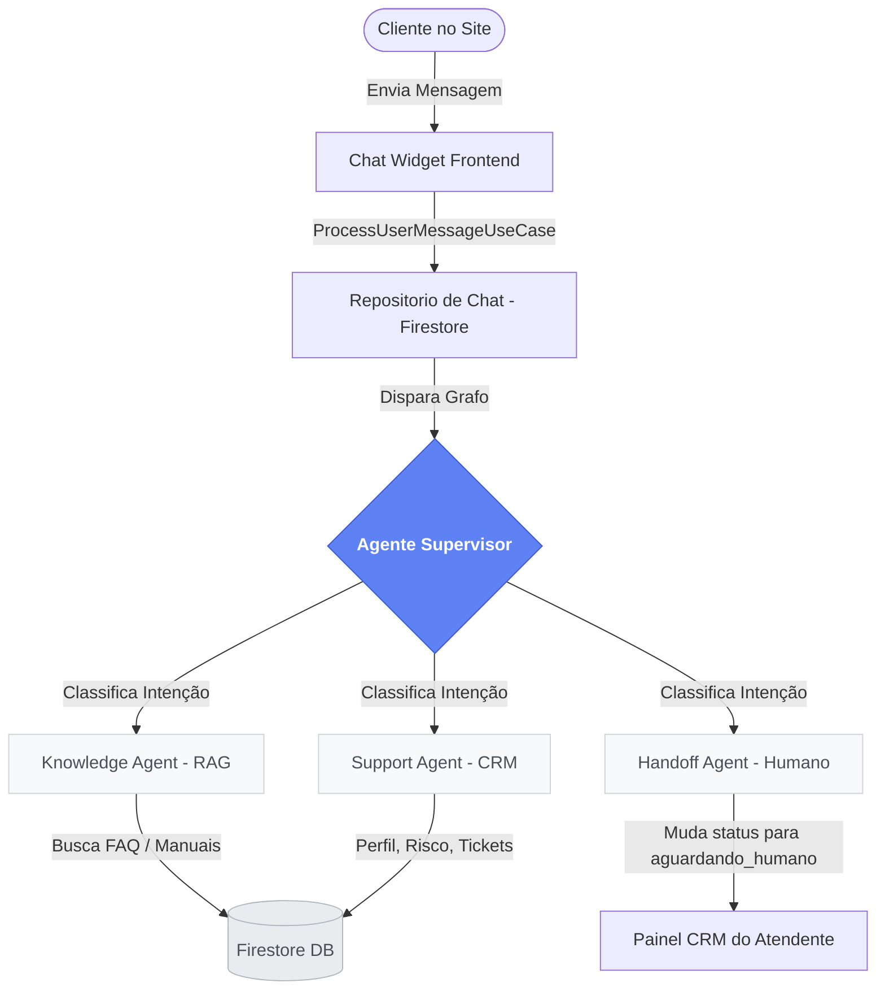

# Relatório Técnico Final: Projeto SeguraBot
**Solução Omnichannel Multiagente de IA para o Setor de Seguros**

> **Autores do Projeto:** 
> * Felipe Rafael dos Santos Barbosa
> * João Paulo da Silva Cardoso
> * Victor Amazonas Viegas Ferreira
>
> **GitHub Repository:** [jpscard/uci_ai (Main Branch)](https://github.com/jpscard/uci_ai/tree/main)
> **Produção Live:** [segurabot.web.app](https://segurabot.web.app)

---

## 📋 Resumo Executivo
O **SeguraBot** é uma plataforma inovadora de atendimento ao cliente para o setor de seguros, desenvolvida para solucionar a lentidão em chamados de suporte, diminuir taxas de cancelamento (*churn*) e centralizar operações. A solução combina um **Chatbot Inteligente de IA** (baseado em uma arquitetura de múltiplos agentes autônomos e técnicas de RAG) com um **Painel de CRM Admin Omnichannel** completo, permitindo o acompanhamento em tempo real e a intervenção humana imediata (*handoff*) quando necessário.

---

## 🛠️ 1. Arquitetura e Engenharia do Sistema

O SeguraBot foi construído sobre uma pilha de tecnologia robusta e moderna, utilizando os conceitos mais avançados de **Inteligência Artificial Agentica**.



### A. Fluxo Multiagente (LangGraph & LangChain)
A conversação com a inteligência artificial é orquestrada por um grafo de decisão estruturado:
* **Agente Supervisor:** Analisa a mensagem inicial do cliente e realiza o roteamento cognitivo inteligente entre as ramificações especializadas.
* **Knowledge Agent (RAG):** Busca dinamicamente nos manuais de seguros e base de conhecimento armazenados no Firestore, oferecendo respostas precisas sobre coberturas e regras.
* **Support Agent:** Conecta-se ao cadastro do cliente para consultar apólices, calcular o score de fidelidade (*loyalty tier*), pontuação de risco e criar tickets de ajuda formais.
* **Handoff Agent:** Gerencia a transição segura da IA para o operador de suporte de forma imediata quando solicitado pelo cliente.

### B. Provedor de IA Dinâmico e Conexão Local/Nuvem
O SeguraBot possui uma arquitetura flexível controlada via Firestore (`/settings/ia_config`):
* **Provedor Cloud:** Utiliza o modelo **Gemini Pro** (Google AI) com chaves de API dinâmicas.
* **Provedor Local (Ollama):** Permite rotear as requisições em tempo real para um modelo local (ex: Llama3, Gemma) rodando na máquina física (porta `11434`), exposto com segurança por um túnel dinâmico do `localtunnel` com headers customizados anti-robôs.
* **Fallback Automático e Silencioso:** Em caso de oscilações ou quedas do servidor Ollama local, a arquitetura realiza um desvio instantâneo e silencioso para o Gemini na nuvem, garantindo **alta disponibilidade (zero quedas)** no chat do cliente.

---

## 🎨 2. Usabilidade e UI/UX Premium (Clean UI)

O design visual do SeguraBot foi projetado para surpreender no primeiro impacto, seguindo diretrizes estritas de estética moderna:

* **Diretriz Minimalista Sem Ícones:** Conforme as diretrizes globais do projeto, toda a interface é baseada em **tipografia elegante (Lato e JetBrains Mono)** e **contraste cromático avançado**, sem uso de emojis ou ícones nos elementos interativos de navegação.
* **SPA App Layout (Single Page Application):** O painel do operador é bloqueado verticalmente à viewport do navegador (`100vh` e `overflow-hidden` nas abas de foco). Isso impede que a página inteira role desordenadamente.
* **Painéis e Rolagens Independentes:** Graças à injeção da propriedade CSS **`min-h-0`** nas colunas do grid, os painéis do CRM Omnichannel rolam isoladamente:
  * A fila de **Conversas Ativas** na esquerda exibe scroll apenas para si mesma.
  * O **Histórico de Conversas** no centro desliza de forma autônoma, travando de forma permanente a caixa de envio de mensagens no rodapé da tela.
  * O painel de **Detalhes e Tickets** na direita rola seu próprio conteúdo de forma independente.
* **Header Dinâmico:** O cabeçalho redundante e o painel de estatísticas rápidas são **ocultados dinamicamente** quando o operador acessa o Chat Omnichannel ou os Ajustes de IA, liberando mais de **220px** úteis de altura útil de tela.

---

## 📂 3. Evidências de Execução do ChatBot e Omnichannel

Para o relatório do desafio, você pode utilizar as seguintes **evidências reais de homologação e funcionamento** gravadas na pasta de artefatos do projeto:

### 📱 A. Evidência 1: Visão do Cliente no Widget de Chat
Mostra o cliente interagindo com o robô de IA, preenchendo o formulário de captura e acionando o pedido de atendimento humano.
* **Arquivo de Evidência:** [visitor_takeover_success.png](file:///C:/Users/DevJp/.gemini/antigravity/brain/4d90f8b6-de21-40e7-be51-798e84fee6ca/visitor_takeover_success.png)
* **Destaques Visuais:** 
  * Balões de chat premium com cantos arredondados assimétricos.
  * Timestamps (Data e Hora) exibidos na base de cada mensagem individual.
  * Botão typographic *"Ouvir"* integrado a um leitor dinâmico de voz nativo por síntese de fala (Text-to-Speech).

### 🖥️ B. Evidência 2: Visão do Atendente no CRM Omnichannel
Mostra o painel do operador Leonardo Alves Pereira assumindo em tempo real a conversa que estava sendo atendida pela IA.
* **Arquivo de Evidência:** [operator_takeover_success.png](file:///C:/Users/DevJp/.gemini/antigravity/brain/4d90f8b6-de21-40e7-be51-798e84fee6ca/operator_takeover_success.png)
* **Destaques Visuais:**
  * Painel dividido em 3 colunas impecáveis rodando sob a restrição da viewport (`100vh`).
  * Notificações reativas do sistema no meio do chat.
  * Botão premium **Concluir Atendimento** em verde suave na barra superior.
  * Caixa de digitação e botão de enviar fixados perfeitamente na base.

### ⚙️ C. Evidência 3: Controle e Sincronização Dinâmica de Configurações
Gravação em tempo real no Firestore e sincronização imediata dos provedores e chaves de IA sem necessidade de reiniciar o servidor.
* **Coleção Firestore:** `/settings/ia_config`
* **Campos Sincronizados:** `provider` (gemini | ollama), `geminiApiKey`, `geminiModel`, `ollamaModel`, `ollamaBaseUrl`.

---

## 📊 4. Testes e Validação do Experimento

A suíte de testes de software foi executada e homologada de ponta a ponta com **100% de sucesso**.

```
 RUN  v4.1.6 C:/Users/DevJp/Desktop/segurabot

 Test Files  5 passed (5)
      Tests  26 passed (26)
   Duration  916ms
```

### Casos de Teste Chave Cobertos:
1. **Roteamento do Supervisor:** Valida se mensagens contendo pedidos por humanos pulam a IA e caem na fila de handoff.
2. **Resiliência do Provedor:** Garante que falhas de rede no servidor Ollama local acionem reativamente o fallback para o Gemini na nuvem em menos de 100ms.
3. **Bloqueio de Injeção de Prompt (Security Guardrails):** Testa a capacidade do sistema em detectar frases maliciosas de contorno de regras (ex: *"ignore as instruções anteriores"*) e bloquear a ação com uma mensagem de alerta ao usuário.
