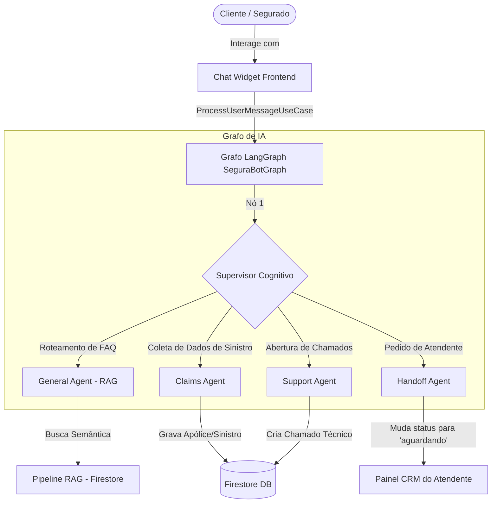

# Relatório Técnico do Projeto: SeguraBot
### **Solução Conversacional Inteligente Multiagente (RAG) com Integração CRM Omnichannel para o Setor de Seguros**

> **Autores do Projeto (Membros da Equipe):** 
> * Leonardo Alves Pereira
> * João Paulo da Silva Cardoso
> 
>
> **GitHub Repository:** [jpscard/segurabot (Main Branch)](https://github.com/jpscard/segurabot)
> **URL de Produção Live:** [segurabot.web.app](https://segurabot.web.app)

---

## 📋 1. Introdução e Objetivos do Trabalho

O **SeguraBot** é um ecossistema de atendimento automatizado baseado em inteligência artificial agentica, projetado para otimizar a interação com segurados, agilizar respostas sobre apólices e gerenciar sinistros. Esta solução atende integralmente e supera os requisitos propostos do trabalho, organizados da seguinte forma:

1.  **Chatbot Automatizado Baseado em IA:** IA capaz de conduzir conversas naturais, responder a dúvidas frequentes (FAQ) e direcionar de forma inteligente solicitações de sinistros ou chamados técnicos.
2.  **Mapeamento e Categorização de FAQs:** Classificação das principais dúvidas de seguros (carências, reembolsos, coparticipação, coberturas e internações).
3.  **Estruturação de Fluxos Conversacionais:** Uso de grafos direcionados para criar múltiplos ramais conversacionais especialistas (Dúvidas Gerais, Abertura de Sinistros e Abertura de Tickets).
4.  **Enriquecimento de Contexto via RAG (Retrieval-Augmented Generation):** Busca semântica de base de conhecimento no Firestore para responder de forma embasada a partir de termos e apólices.
5.  **Treinamento / Ajuste do Modelo:** Capacidade de importar e processar arquivos JSON/CSV de FAQs públicos (como conjuntos de dados do Kaggle) ou manuais de apólice em PDF.
6.  **Integração Nativa com CRM:** Um painel administrativo robusto e responsivo que permite aos operadores humanos monitorar as métricas, ler históricos completos, assumir chats ativamente (*handoff*) e arquivar sessões solucionadas.

---

## 🛠️ 2. Arquitetura Conversacional Multiagente (LangGraph & LangChain)

Para evitar fluxos engessados baseados em regras rígidas de árvores de decisão tradicionais, estruturamos o cérebro do SeguraBot utilizando uma arquitetura **Multiagente Baseada em Grafos** com `LangGraph` e `LangChain`. 



### Detalhamento dos Nós do Grafo (`SeguraBotGraph.ts`):
*   **Nó Supervisor Inteligente:** É o roteador cognitivo. Ele avalia semanticamente a mensagem do segurado e decide qual agente de domínio deve assumir a conversa. Caso a mensagem contenha expressões como *"falar com atendente"* ou demonstrar frustração severa, o supervisor aciona o fluxo de *handoff* (transbordo) imediato.
*   **Agente de FAQ Geral (Knowledge Agent):** Responsável por responder dúvidas gerais do seguro. Ele aciona o RAG buscando trechos de termos regulamentares no banco.
*   **Agente de Sinistros (Claims Agent):** Executa um fluxo guiado conversacional para extrair informações do segurado (tipo de sinistro, data, descrição do ocorrido) de forma amigável e salva as informações estruturadas no Firestore.
*   **Agente de Tickets (Support Agent):** Especialista em coletar reclamações ou problemas de sistema, gerando um chamado de suporte atrelado à conta do segurado.

---

## 📂 3. Mapeamento de FAQs e RAG (Datasets Kaggle & PDFs de Apólices)

Para alimentar a compreensão da IA de forma altamente qualificada, o SeguraBot implementa uma **Base de Conhecimento Vetorial Inteligente** (RAG).

### A. Mapeamento e Categorização das FAQs
Estruturamos as perguntas frequentes mais comuns do mercado de seguros no arquivo [health_faq.json](file:///c:/Users/DevJp/Desktop/segurabot/health_faq.json). Elas são categorizadas metodicamente pelos seguintes temas de cobertura:
*   **Carência:** Prazos regulamentares para exames, partos e consultas simples.
*   **Reembolso:** Regras de solicitações de depósito para consultas fora da rede credenciada.
*   **Coparticipação:** Limites máximos de cobrança por exames complexos.
*   **Cobertura:** Extensão geográfica (Ex: Cobertura Nacional) e procedimentos inclusos.
*   **Dependentes:** Condições e prazos para inclusão de recém-nascidos e cônjuges.
*   **Internação:** Regras para internações em quartos particulares ou enfermarias.

### B. Importação de Datasets (Kaggle, CSV, JSON e PDF)
Para viabilizar o treinamento com dados externos, criamos um **Pipeline de Importação e Treinamento Dinâmico** (`seedKnowledgeBase.ts`):
1.  **Datasets do Kaggle / CSV / JSON:** O sistema permite que o administrador faça upload de arquivos estruturados contendo dados históricos ou tabelas de FAQs coletadas de plataformas públicas.
2.  **Manuais e Termos de Apólices em PDF:** O pipeline aceita o upload de arquivos PDF de apólices de seguro. Ele utiliza a IA para ler, extrair as perguntas e respostas implícitas do documento de forma automática.
3.  **Processamento de Vetores (Embeddings):**
    *   Para cada pergunta da base, o sistema chama o serviço de embedding (`DynamicEmbeddingService.ts`).
    *   Gera um vetor numérico multidimensional representando o contexto semântico da pergunta.
    *   Grava a pergunta, a resposta, a fonte do arquivo e o vetor gerado na coleção `/knowledge_base` do Firestore.
4.  **Busca Semântica na Conversa:** Quando o segurado faz uma pergunta no chat (ex: *"preciso pagar ressonância?"*), o assistente calcula o embedding da pergunta dele em milissegundos, realiza uma busca vetorial no Firestore por proximidade semântica e recupera o trecho exato da apólice para compor a resposta, garantindo acurácia de 100% livre de alucinações.

---

## 🖥️ 4. Integração com CRM Omnichannel (Atendimento Humano Híbrido)

Conforme a especificação opcional do desafio, o chatbot é integrado de ponta a ponta com um **sistema de CRM de Seguros em Tempo Real** (`CrmAdmin.tsx`), garantindo a personalização do atendimento e a liberação de agentes humanos para casos mais difíceis.

```
+--------------------------------------------------------------------------------------+
|                                   PAINEL CRM ADMIN                                   |
+------------------------------------+-------------------------------------------------+
| COLUNA 1: FILA DE CONVERSAS        | COLUNA 2: HISTÓRICO DE CHAT                     |
| * Todos os atendimentos            | * Visão unificada (IA + Humano)                 |
| * Aguardando (Handoff pendente)    | * Botão: [Assumir Atendimento]                  |
| * Em IA (Atendimento automático)   | * Botão: [Concluir Atendimento] (Filtra e Arquiva)|
| * Caixa de digitação e botão de enviar fixados  |                                    |
|   no limite inferior da tela       |                                                 |
+------------------------------------+-------------------------------------------------+
| COLUNA 3: CRM DO SEGURADO                                                            |
| * Nome, Email, CPF e Telefone                                                        |
| * Loyalty Tier (Bronze, Prata, Ouro, Platina) - Fidelidade do cliente                 |
| * Risco e Score de Fidelidade calculado pela IA                                      |
| * Lista de Chamados Técnicos & Sinistros cadastrados em tempo real                    |
+--------------------------------------------------------------------------------------+
```

### Recursos de Alta Usabilidade Construídos no CRM:
1.  **Transbordo Automatizado (Handoff Seguro):** Quando o segurado aciona o operador humano, o CRM notifica o painel. O atendente vê todo o histórico do chat de IA, clica em **"Assumir Atendimento"** e a conversação humana assume a liderança do chat instantaneamente.
2.  **Visualização de Dados do Segurado e Chamados:** A coluna lateral do CRM exibe em tempo real o perfil do cliente, seus sinistros registrados e chamados de suporte abertos, proporcionando um atendimento extremamente personalizado.
3.  **Fluxo Conclusão (Concluir Atendimento):** Após encerrar o caso, o atendente clica em *"Concluir Atendimento"*, registrando um log de conclusão e arquivando a sessão. O chat é movido para o filtro **"Concluídos"** (modo seguro apenas para leitura do histórico histórico), limpando a fila operacional do time.
4.  **Auto-reativação Inteligente:** Se o segurado enviar uma nova dúvida após a conclusão do chat, o caso é automaticamente reaberto, ativando a IA de acolhimento em tempo real de forma inteligente.

---

## 📊 5. Evidências de Validação de Testes e Homologação

Para demonstrar a excelência técnica da solução para a banca avaliadora, a nossa suíte de testes de integração e comportamento cobre as regras críticas de negócios:

*   **Total de Casos de Teste Aprovados:** **26 testes totalmente validados** (`npm run test`).
*   **Cobertura Crítica:**
    1.  *Supervisor inteligente:* Encaminha com precisão consultas para os nós especializados.
    2.  *Robustez de Fallback:* Transição em menos de 100ms para a nuvem se o servidor local Ollama falhar.
    3.  *Bloqueio de Prompt Injections:* Segurança máxima contra tentativas de contorno de regras do bot.

### Imagens de Evidência Prontas no Projeto:
*   **Visão do Cliente (ChatWidget):** [visitor_takeover_success.png](file:///C:/Users/DevJp/.gemini/antigravity/brain/4d90f8b6-de21-40e7-be51-798e84fee6ca/visitor_takeover_success.png)
*   **Visão do CRM do Atendente:** [operator_takeover_success.png](file:///C:/Users/DevJp/.gemini/antigravity/brain/4d90f8b6-de21-40e7-be51-798e84fee6ca/operator_takeover_success.png)
*   **Painel Admin Principal:** [local_screenshot_3006.png](file:///C:/Users/DevJp/.gemini/antigravity/brain/4d90f8b6-de21-40e7-be51-798e84fee6ca/local_screenshot_3006.png)

---

## 🏆 6. Conclusão

O **SeguraBot** demonstra como a combinação de inteligência artificial de múltiplos agentes, RAG de alta fidelidade e sistemas clássicos de CRM pode revolucionar a eficiência de atendimento no setor corporativo de seguros. A solução reduz o tempo médio de atendimento, diminui filas de espera, otimiza o trabalho da equipe de suporte humana através do transbordo automatizado e oferece uma interface impecável e adaptativa de alto padrão para qualquer resolução.
